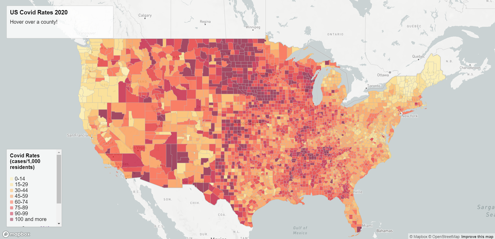
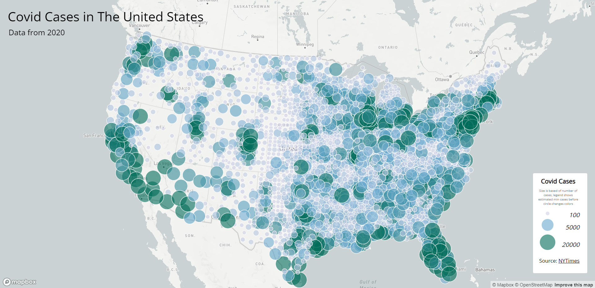

# us-covid-2020

## Showing Covid Cases Throughout The United States in 2020

This project shows 2 maps depicting different statistics of Covid-19 cases in 2020 in the U.S. Map 1 is a choropleth map showing the rate of covid cases per 1,000 residents for each county. Map 2 is a proportional symbols map showing the cases in each area on the map.

### Map 1

[Map 1](https://matruong2.github.io/us-covid-2020/map1.html) separates the data by county level using the U.S. county boundary shapefile from [the U.S. Census Bureau](https://www.census.gov/geographies/mapping-files/time-series/geo/carto-boundary-file.html). The datasets used to calculate the covid cases per 1,000 residents are from [The New York Times](https://github.com/nytimes/covid-19-data/blob/43d32dde2f87bd4dafbb7d23f5d9e878124018b8/live/us-counties.csv) and [2018 ACS 5 year estimates](https://data.census.gov/cedsci/table?g=0100000US.050000&d=ACS%205-Year%20Estimates%20Data%20Profiles&tid=ACSDP5Y2018.DP05&hidePreview=true). The New York Times dataset had covid case data which was then divided by the population data from teh 2018 ACS 5 year estimates dataset.

After combining all these datasets together, map 1 could be created with the primary function of being able to hover over the county to see the rate of covid cases show up on the top left text box.

### Map 2

[Map 2](https://matruong2.github.io/us-covid-2020/map2.html) displays the total cases in each circle on the using the dataset from [The New York Times](https://github.com/nytimes/covid-19-data/blob/43d32dde2f87bd4dafbb7d23f5d9e878124018b8/live/us-counties.csv). Map 1's primary function is clicking on the circles to see the total covid cases be displayed on top of the circle.

## Acknowledgement

The data has been processed by Steven Bao.